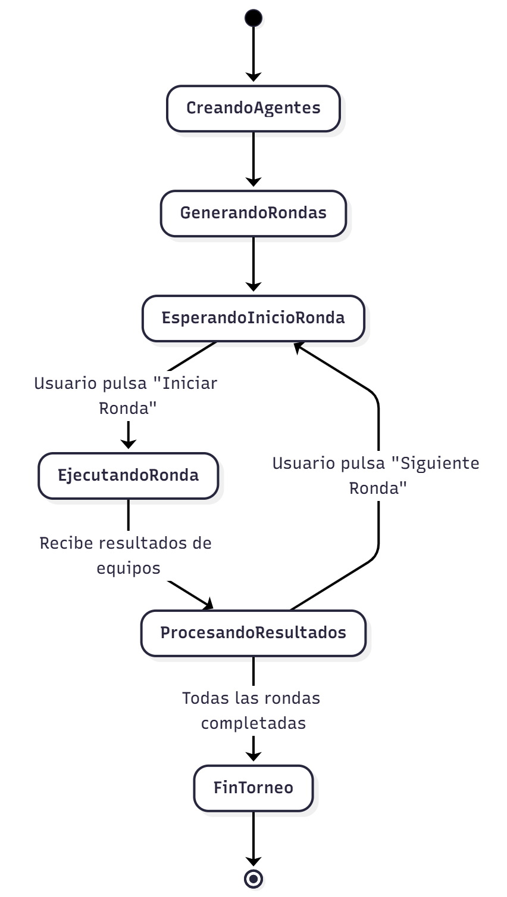
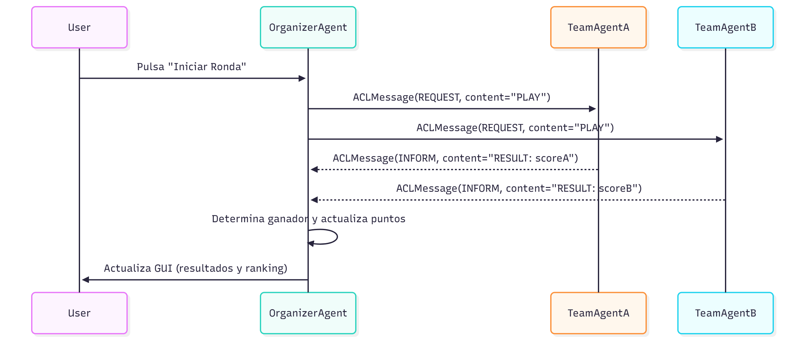

# Simulación de Torneo de Palas de Playa con JADE

Este proyecto simula un torneo de palas de playa utilizando un sistema multi-agente implementado con el framework JADE (Java Agent Development Framework). La simulación es gestionada por un agente organizador que crea jugadores y equipos, organiza los partidos en rondas y muestra los resultados en una interfaz gráfica de usuario (GUI).

## Flujo de Ejecución

1.  **Inicio:** La simulación comienza al lanzar el `OrganizerAgent`.
2.  **Creación de Agentes:**
    *   El `OrganizerAgent` crea un número aleatorio (entre 12 y 22) de `PlayerAgent`.
    *   Agrupa a los jugadores en parejas aleatorias para formar equipos.
    *   Crea un `TeamAgent` por cada pareja, asignándole una habilidad base aleatoria.
3.  **Generación del Torneo:**
    *   El organizador genera una lista de todos los partidos posibles (formato *round-robin*, todos contra todos).
    *   Divide el total de partidos en varias rondas para estructurar el torneo.
4.  **Gestión de Rondas (Bucle Principal):**
    *   **Presentación de la Ronda:** El `OrganizerAgent` muestra los partidos de la ronda actual en la GUI y espera a que el usuario presione el botón "Iniciar Ronda".
    *   **Ejecución de Partidos:** Al recibir la señal del usuario, el `OrganizerAgent` envía un mensaje `REQUEST` con el contenido "PLAY" a los dos `TeamAgent` que compiten en cada partido de la ronda.
    *   **Cálculo de Rendimiento:** Cada `TeamAgent` recibe la solicitud, calcula su rendimiento para ese partido (basado en su habilidad y el número de partidos ya jugados) y responde al organizador con un mensaje `INFORM` que contiene su puntuación.
    *   **Resolución de Partidos:** El `OrganizerAgent` recoge las puntuaciones, determina el ganador de cada partido, actualiza los puntos de los equipos y refresca la GUI con los resultados y la clasificación actualizada.
    *   **Pausa y Siguiente Ronda:** El sistema espera a que el usuario pulse "Siguiente Ronda" para comenzar el ciclo de nuevo con la siguiente tanda de partidos.
5.  **Fin del Torneo:**
    *   Una vez que se han jugado todas las rondas, el `OrganizerAgent` muestra una ventana emergente con la clasificación final y los ganadores de las medallas de Oro, Plata y Bronce.

## Descripción de Archivos

### Agentes (`palasDePlaya.agentes`)

*   `OrganizerAgent.java`: Es el agente central y el director del torneo. Sus responsabilidades incluyen:
    *   Crear dinámicamente los agentes `PlayerAgent` y `TeamAgent`.
    *   Gestionar la lógica del torneo: rondas, partidos y puntuaciones.
    *   Controlar la interfaz gráfica (Swing) para mostrar el estado del torneo y recibir la entrada del usuario.
    *   Comunicarse con los `TeamAgent` para iniciar los partidos y recibir los resultados.

*   `TeamAgent.java`: Representa a un equipo.
    *   Posee una habilidad base y un modelo de rendimiento que disminuye con cada partido jugado.
    *   Responde a las solicitudes de partido del `OrganizerAgent` calculando y enviando su puntuación.

*   `PlayerAgent.java`: Representa a un jugador individual. En esta versión, es un agente simple que sirve para ser agrupado dentro de un `TeamAgent`.

### Modelo de Datos (`palasDePlaya.model`)

*   `TeamInfo.java`: Clase de datos utilizada por el `OrganizerAgent` para almacenar información de cada equipo, como su nombre, jugadores, puntos acumulados y partidos jugados.
*   `Partido.java`: Clase que representa un único partido, conteniendo los nombres de los dos equipos, sus puntuaciones y el resultado (ganador).

### Utilidades (`palasDePlaya.utils`)

*   `TeamPerformance.java`: Clase de utilidad que define el modelo de rendimiento de un equipo. Calcula el rendimiento actual basándose en la habilidad inicial y una función de decaimiento exponencial que simula el cansancio a medida que se juegan más partidos.

## Diagramas:
### Diagrama de estados del OrganizerAgent:

### Diagrama de Secuencia de Mensajes:

---